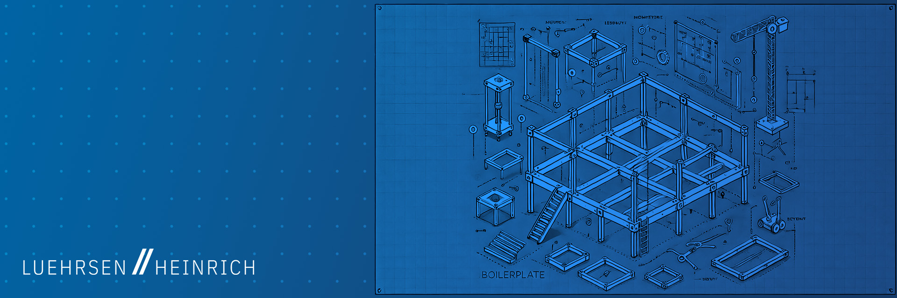

# WordPress Project Boilerplate

This boilerplate serves as a **production-ready template** for Luehrsen // Heinrich agency client projects. It provides a structured foundation for creating **Hybrid WordPress Themes** that combine traditional classic theme features with modern block-based capabilities (Gutenberg). 

Built with **@wordpress/env**, **webpack**, and **PostCSS**, this template adheres to WordPress best practices by cleanly separating business logic (plugin) from presentation (theme). The boilerplate includes a complete development environment, CI/CD workflows, and automated release management—ready to clone and customize for any client project.

Learn more about Hybrid Themes [here](https://gutenbergmarket.com/news/what-are-hybrid-wordpress-themes).

## Using This Template

This repository is designed to be cloned as a starting point for new client projects. Follow these steps to set up your project:

### Prerequisites

Before starting, ensure you have:
- **Docker** installed and running (required for local development environment)
- **Node.js 20.x** (LTS) and **npm 10.x**
- **PHP 8.4+** and **Composer 2.x**

1. **Use as Repository Template**: Click "Use this template" on GitHub to create a new repository for your client project.
2. **Project Slug**: Choose a unique slug that won't conflict with other projects (recommended: client abbreviation + project type).
### Step 1: Set Up Project Slug and Names

1. **Replace Project Slug**:
   - Search and replace (case-sensitive):
     - `lhpbp` with your new project-specific slug.
     - `LHPBP` with the uppercase version of your slug.

2. **Update Details**:
   - Modify project information in `package.json`.
   - Update file headers in `theme/style.css` and `plugin/lhpbpp.php`.

3. **Rename Plugin File**:
   - Rename the main plugin file from `plugin/lhpbpp.php` to `plugin/<your_project_slug>p.php`.

### Step 2: Run the Development Environment

1. **Start the Environment**:
   - Run `npm start` to spin up the Docker environment.

2. **Access WordPress Admin**:
   - Open `http://localhost/wp-admin` in your browser.
   - Use the credentials `admin` (username) and `password` (password) to log in.

### Step 3: Understand the Release Workflow

Releases are automated via **release-please**:

1. **Make Changes**: Commit changes using Conventional Commits format (e.g., `feat:`, `fix:`, `chore:`).
2. **Automatic Release PR**: When merged to `main`, release-please creates/updates a release PR with changelog and version bumps.
3. **Merge Release PR**: When the release PR is merged, a GitHub release is created with built artifacts automatically.
4. **Setup Required**: Ensure `GH_ADMIN_TOKEN` is configured in [GitHub Action secrets](../../settings/secrets/actions).

### Step 4: Finalize Documentation

1. **Customize Documentation**:
   - Edit `project-README.md` with your specific project details.

2. **Organize README Files**:
   - Delete or rename this `README.md` (current file).
   - Rename `project-README.md` to `README.md`.

3. **Celebrate 🎉**

## What Are Hybrid Themes?

Hybrid WordPress Themes represent a **middle ground** between traditional Classic Themes and Full Site Editing (FSE) Block Themes. They combine elements of both, allowing users to take advantage of block-based design capabilities while retaining familiar classic theme functionality. Hybrid Themes offer a balanced approach, providing flexibility without requiring a full commitment to FSE.

**Benefits of Hybrid Themes**:
- **Balanced Editing Experience**: Supports both classic and block editing modes, allowing for flexibility in design and layout.
- **Enhanced Block Capabilities**: Includes features like block templates, block parts, and custom configurations via `theme.json`.
- **Greater Design Control**: Allows extensive customization for pages, posts, and archive layouts while keeping traditional editing options.
- **Compatibility**: Works seamlessly with both classic WordPress setups and Block Editor elements, providing the best of both worlds.

This boilerplate enables you to develop a flexible, scalable Hybrid Theme that leverages the strengths of both classic and block-based features, delivering a future-ready WordPress experience with maximal control and compatibility.
